# <center>Monkey test<center>

***注意：需要安装 xcode，证书可以让开发哥哥们提供。***

下载的软件
[USBClient](USBClient.zip)      
事例脚本   
[登录脚本](login.py)
[退出登录脚本](logout.py)

### 先看看效果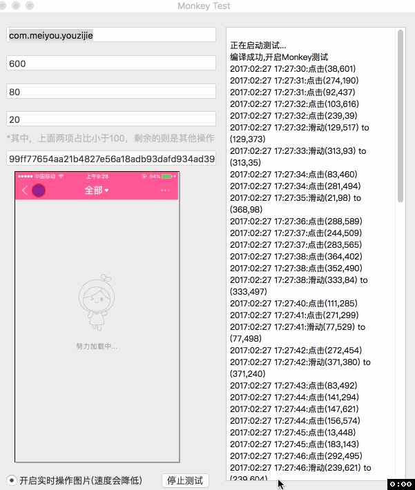
上面就是mokey test了，是运行到真机上的，介绍一下如何使用。   

* 1.首先下载项目(IMY_WebDriverAgent 可以看一下WDA的介绍，是FB出品)   

* 2.到项目目录内 打开 ```WebDriverAgent.xcodeproj```    
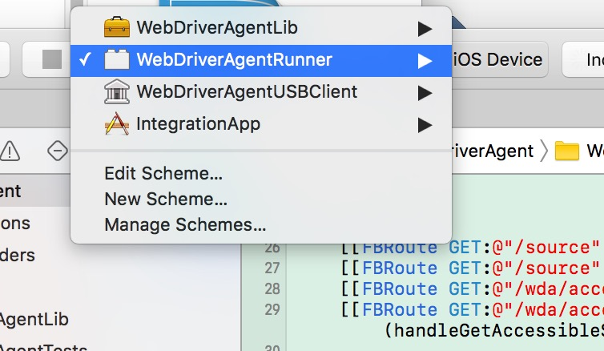 左上角选择(```WebDriverAgentRunner```)。


* 3.接着选择 Build Settings
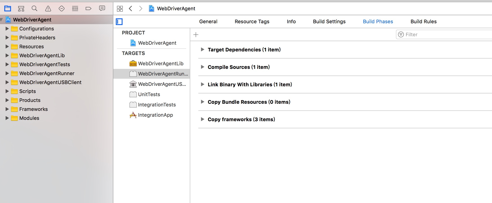
找到如下位置，选择好证书(这样才能在真机运行)
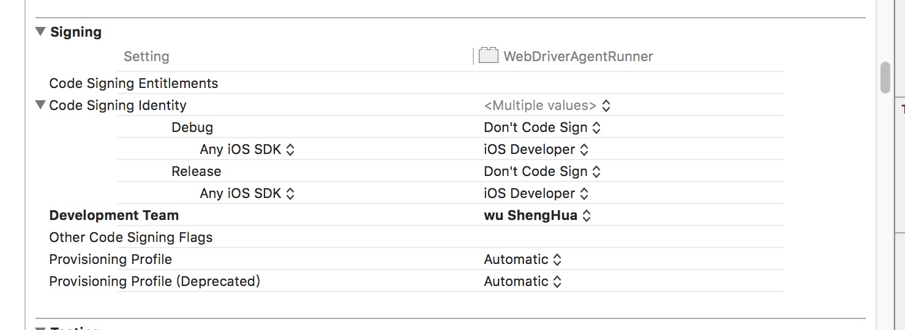


* 4.打开终端输入命令 ```instruments -w devices```
复制USB连接的手机的设备号(如：<font color=red>"99ff77654aa21b4827e56a18adb93dafd934ad39"</font>)
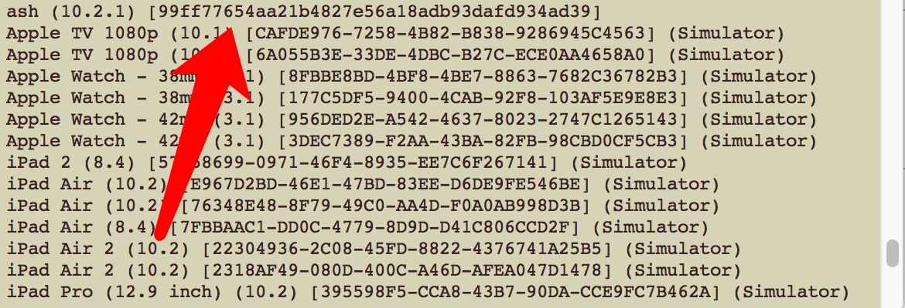


* 5.终端中输入命令(ps：要在项目目录下)   

```
xcodebuild -project WebDriverAgent.xcodeproj -scheme WebDriverAgentRunner -destination "id=99ff77654aa21b4827e56a18adb93dafd934ad39" test

```
<font color=red>其中的id替换成自己的设备号</font>


* 6.终端会输出测试过程中的信息，结束之后会输出log位置
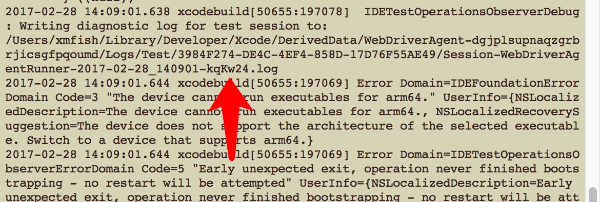

* 7.打开软件[USBClient](USBClient.zip)
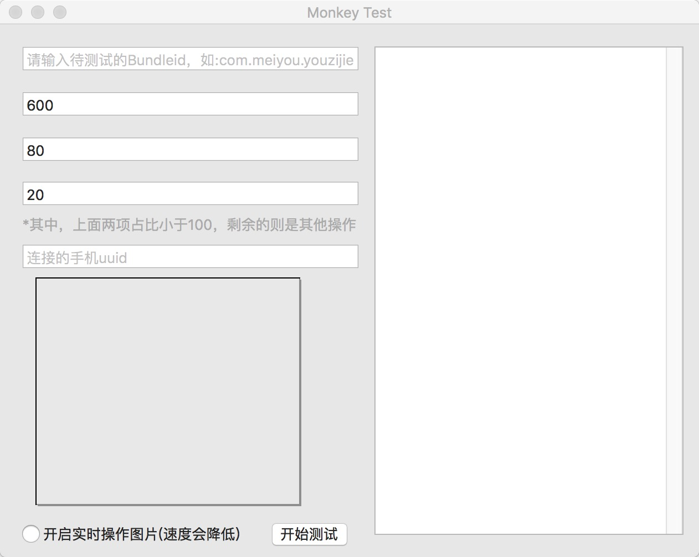 
上图：分别填入的是  
1:待测试的App的Bundleid   
2:测试的时间(单位s)  
3:点击事件占比   
4:滑动事件占比   
5:手机的设备号
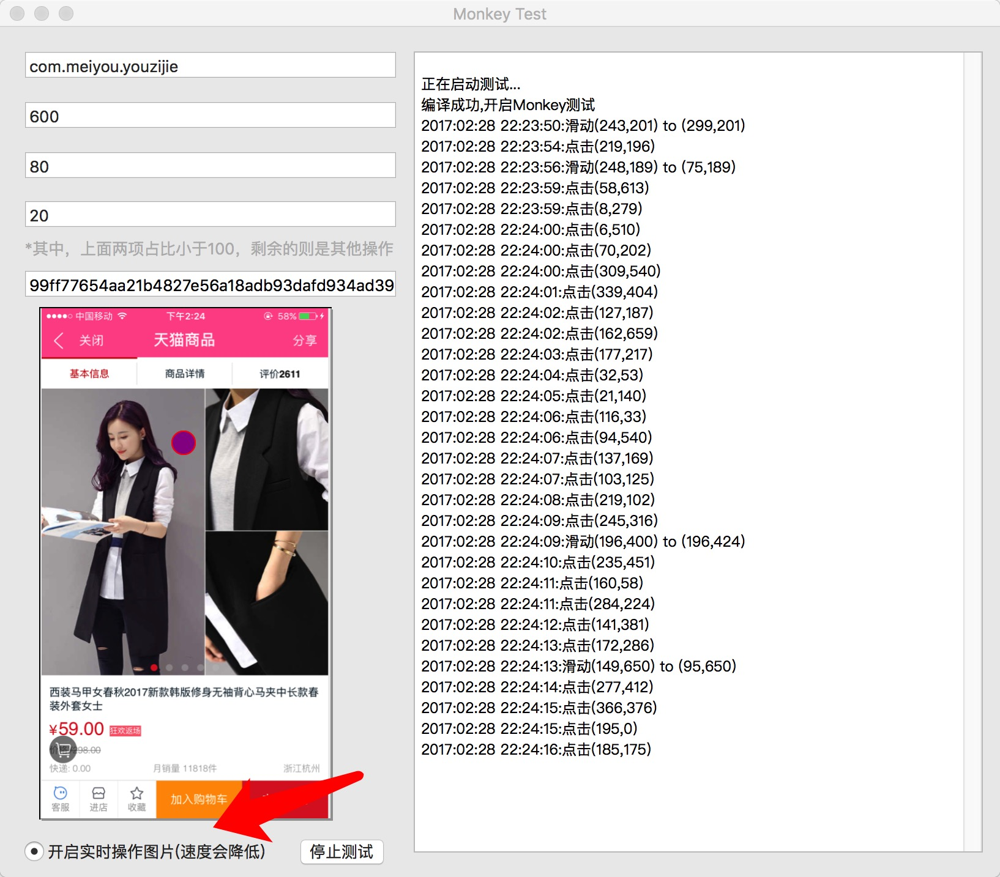 
这是点击是否需要实时显示操作图片的，选择之后操作速度会明显下降。
到此，就完成了MonkeyTest了。


### 2.进阶，编写脚本进行自动化测试

* 1.首先前面5步和之前一样，不过这一次可以运行到模拟器上。
* 2.然后在浏览器打开对应ip的网址如: ```http://192.168.199.180:8100/inspector```
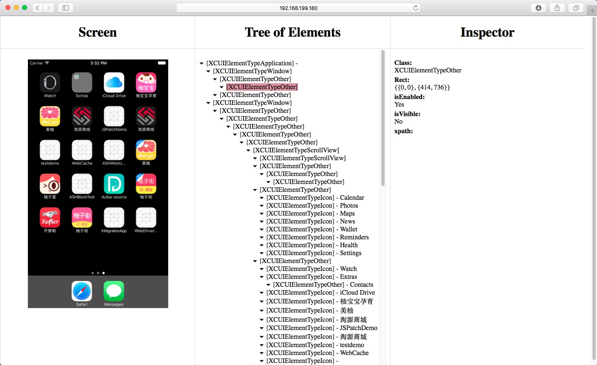
上面可以查看页面的结构，后面编写脚本需要用到
* 3.安装python(这个我就不详细介绍了)
* 4.安装 ATX 

```pip install --pre --upgrade atx```
```pip install opencv_python```
* 5.接下去可以开始编写脚本了。   

```
import atx
com = atx.connect("http://localhost:8100") 
```
首先导入 atx，如果是本机模拟器，则ip填写```localhost```即可。   
下面介绍一下，常用的命令。

### 应用的启停
```
com.start_app('com.ash') # 启动
com.stop_app() #停止应用
```
### 基本操作
屏幕大小，这里是实际显示的大小。截图是多大，返回的就是多大

```
dis = com.display
print dis.width, dis.height
```
### 截图

```
image = com.screenshot() # 返回PIL图片
image.save("screen.png") # 保存成文件，这个是PIL的基础用法。其他的什么旋转，抠图，还有很多
```
### 坐标点击  

```
com.click(20, 30)
```

### 滑动
```
com.swipe(300, 400, 300, 100, 1.0) # 从(300, 400)滑动到 (300, 100) 时间1.0s (默认0.2s)
```

### 选择控件
浏览器打开WDA的inspector窗口
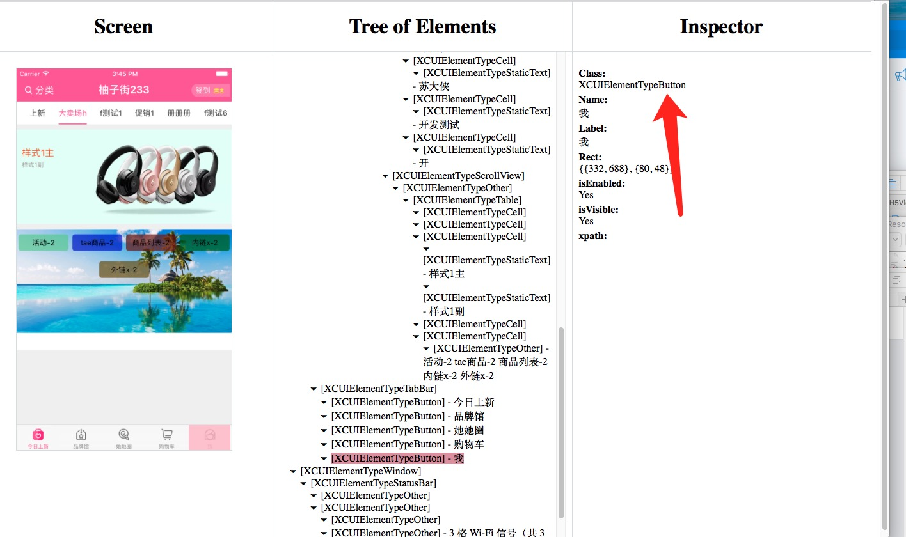  
右上角的用户图标，我们可以根据Class，Name，Label来定位

```
#  根据所有属性定位
elem = com(class_name="XCUIElementTypeButton", name="\u6211", label="\u6211") #这里的中文需要用unicode代替。
#  使用下标定位，界面上的第2个Button（下标是从0开始的）
elem = com(class_name="XCUIElementTypeButton", index=1)
elem = com(class_name="XCUIElementTypeButton")[1] # 跟上面的命令等价
```
### 通过xpath定位
xpath有很多的规则，我用的很少，欢迎高手留言补充。这种操作比较慢，但是功能强大   
```
elem = com(xpath="//Button")
```
### 控件操作
```
elem.exists # 判断控件是否存在
len(elem) # 返回符合条件元素的个数

elem.click() # 等待并点击
elem.click(timeout=5.0) # 5s之内还有出现符合条件的元素，直接跑异常。timeout目前默认都是90s
elem.wait(timeout=5) # 等待目标的出现
elem.tap_hold(2) # 长按2s


elem.bounds # 返回namedtuple，这个坐标体系还需要乘以 com.scale 才能转化成ATX的坐标体系。
# Returns
# Rect(x=279, y=29, width=25, height=25)

# 获取元素的属性
elem.class_name
elem.text # 这个跟inspector中的Name一个意思
elem.value
elem.enabled # 是否启用
elem.displayed # 这个还真的很少用

elem.set_text("James") # 设置文本
elem.value # 获取刚刚输入的文本
elem.clear_text() # 清空刚刚输入的文本
```

### Scroll

```
s(text="Vitals").scroll() # scroll to visible
s(text="Login").scroll().click() # 滑到到该元素，然后点击
s(text="Hello").scroll(direction="right", timeout=5.0) # 指定滑动的方向向右，方向有4个up | down | left | right
# 有点尴尬了，我也不记得下面两个是干什么用的了
s(text="Hello").scroll(text="World")
s(text="Hello").scroll(text_contains="World")
```
###最后看一下登录和退出登录的脚本
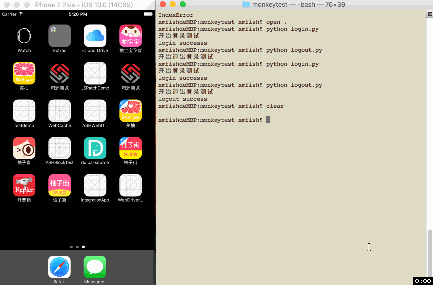     
贴一下脚本代码   
[登录脚本](login.py)
[退出登录脚本](logout.py)

```
# coding:utf-8
import atx
import os
import time

com = atx.connect("http://localhost:8100") 
com.start_app("com.app")
print(u'开始登录测试')
time.sleep(3)

# 获取我的按钮
my_btn = com(class_name="XCUIElementTypeButton", name='\u6211', label='\u6211')
my_btn.click()

# 获取我页面的第二个cell
my_cell = com(class_name="XCUIElementTypeCell")[1]
my_cell.click()

# 获取账号输入框
account_label = com(class_name="XCUIElementTypeTextField")[0]
account_label.clear_text()
account_label.set_text("15657128262")

# 获取密码输入框
pwd_label = com(class_name="XCUIElementTypeSecureTextField")[0]
pwd_label.clear_text()
pwd_label.set_text("a123456")

# 登录按钮
login_btn = com(class_name="XCUIElementTypeButton", name='\u767b\u5f55', label='\u767b\u5f55')
login_btn.click()

# 最后判断是否在我的页面，是表示成功
nav_title = com(class_name="XCUIElementTypeNavigationBar")[0]
time.sleep(1)
if nav_title.exists:
print('login successs')
# os._exit()
```

```
# coding:utf-8
import atx
import os
import time

com = atx.connect("http://localhost:8100") 
com.start_app("com.")
print(u'开始退出登录测试')
time.sleep(3)

# 获取我的按钮
my_btn = com(class_name="XCUIElementTypeButton", name='\u6211', label='\u6211')
my_btn.click()

# 获取我页面的第二个cell
my_cell = com(class_name="XCUIElementTypeCell")[1]
my_cell.click()


# 退出登录按钮
login_btn = com(class_name="XCUIElementTypeButton", name='\u9000\u51fa\u767b\u5f55', label='\u9000\u51fa\u767b\u5f55')
login_btn.click()

# 点击确定按钮
sure_btn = com(class_name="XCUIElementTypeButton", name='\u786e\u5b9a', label='\u786e\u5b9a')
sure_btn.click()

# 判断是否有立即登录按钮，有代表成功
nowlogin_btn = com(class_name="XCUIElementTypeButton", name='\u7acb\u5373\u767b\u5f55', label='\u7acb\u5373\u767b\u5f55')
time.sleep(1)
if nowlogin_btn.exists:
print("logout success")

# os._exit()
```
